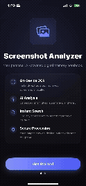

# ScribeShot — AI Screenshot Organizer for iOS

> Your screenshot folder is a graveyard. ScribeShot brings it back to life.

ScribeShot automatically scans your iOS camera roll, reads the text on each screenshot using on-device OCR, and uses OpenAI to generate titles, summaries, and tags — giving you a fully searchable, organized knowledge base built entirely from screenshots you already have.

Your API key never leaves your device. Your images never leave your device. Only the extracted text is sent to OpenAI — and even that stays under your control.


---



---

## What It Does

Most people take dozens of screenshots a week — receipts, articles, code snippets, conversations, ideas — and then never find them again. ScribeShot fixes that by treating every screenshot as structured data rather than just an image.

Here's the flow:

1. **Import** — ScribeShot detects screenshots in your iOS Photo Library automatically, running in the background using `PhotoKit`.
2. **Extract** — Apple's `Vision` framework reads the text off each screenshot entirely on-device. No server involved.
3. **Analyze** — The extracted text block (not the image) is sent to the OpenAI API, which generates a human-readable title, a context summary, and relevant tags.
4. **Store** — Everything is saved locally using `SwiftData`. Your screenshots, their text, their metadata — all in your app's sandbox.
5. **Search** — Query across titles, summaries, tags, and raw extracted text in real time from a single search bar.

---

## Features

- **Automated Background Import** — Monitors your Photo Library using `PHPhotoLibraryChangeObserver`, filtering specifically for `.photoScreenshot` media subtype so it only processes real screenshots, not photos.
- **On-Device OCR** — Text extraction via Apple's native `Vision` framework (`VNRecognizeTextRequest`). Fast, private, offline.
- **AI Metadata Generation** — Sends only the raw text to OpenAI to produce a structured title, context summary, and tags. No image data ever leaves the device.
- **Keychain-Protected API Key** — Your OpenAI API key is stored in the device's hardware-secured Keychain via Apple's `Security` framework. Safe auto-migration from `UserDefaults` runs on first launch for any legacy installs.
- **Live API Verification** — Test your OpenAI credentials directly in Settings with real-time diagnostic feedback and Apple-style visual confirmation.
- **Smart Empty-Text Fallback** — Screenshots with no extractable text (UI mocks, drawings, photos) are detected immediately and completed with local fallbacks — no unnecessary API calls, no wasted tokens.
- **Unified Deep Search** — Search across titles, context summaries, tags, and raw on-device OCR text simultaneously, in real time.
- **Native Apple Design** — Standard `.insetGrouped` form layout, native shadows, centered screenshot previews, and modern grayscale capsule tag chips with swipe-to-delete.

---

## Tech Stack

| Layer | Technology |
|---|---|
| OS Target | iOS 17.0+ |
| UI Framework | SwiftUI |
| Database | SwiftData (local, type-safe) |
| OCR Engine | Vision Framework (`VNRecognizeTextRequest`) |
| Credential Security | Keychain Services (`Security` framework) |
| Remote API | OpenAI API (JSON structured output) |

---

## Project Architecture

Follows a clean MVVM pattern with feature-grouped views and isolated service layers.

```
ScribeShot/
├── App/                     # App entry point and lifecycle
├── Models/                  # SwiftData entities (ScreenshotItem, Tag, etc.)
├── Views/
│   ├── Home/                # Screenshot grid dashboard
│   ├── Detail/              # Inset-grouped detail view and tag editor
│   ├── Settings/            # API key input, verification, and Keychain config
│   ├── Search/              # Real-time multi-parameter search
│   └── Onboarding/          # Permission setup and welcome flow
├── ViewModels/              # Observable ViewModels driving all UI state
├── Services/                # Keychain helper, background sync queue, OpenAI client
└── Resources/               # AppIcon asset catalogs
```

---

## Getting Started

### Prerequisites

- macOS Sonoma 14.0+
- Xcode 15.0+
- An OpenAI API key → [Get one here](https://platform.openai.com/api-keys)

### Installation

```bash
git clone https://github.com/Abhishek6353/scribeshot-ios.git
cd scribeshot-save-screenshot-context
open AnalyzeScreenshot.xcodeproj
```

Then in Xcode:
1. Select an iOS 17.0+ Simulator or a connected physical device.
2. Press `Cmd + R` to build and run.

### Configuration

1. Open the **Settings** tab inside the app.
2. Paste your OpenAI API key into the input field.
3. Tap **Verify API Key** — you'll see a live confirmation or a specific error message if something is wrong.
4. That's it. ScribeShot will begin analyzing screenshots automatically.

---

## Privacy

ScribeShot was built with a privacy-first architecture. Here's exactly what happens with your data:

| Data | What Happens |
|---|---|
| Screenshot images | Never uploaded. Stored only in your local sandbox. |
| Extracted text | Sent to OpenAI API for analysis only. Not stored externally. |
| OpenAI API key | Stored in hardware-secured iOS Keychain. Never logged or transmitted. |
| App metadata | Computed locally from OCR text. No device logs or external signals accessed. |

All persistent data lives in your app's local SwiftData container. Deleting the app deletes everything.

---

## Roadmap

- [ ] iCloud sync for cross-device access
- [ ] Local LLM support (on-device model via Core ML) as a no-API-key option
- [ ] Folder/collection grouping for tags
- [ ] Share extension for importing screenshots from other apps
- [ ] Export to Markdown or Notion

---

## Contributing

Pull requests are welcome. For significant changes, please open an issue first to discuss what you'd like to change.

1. Fork the repository
2. Create a feature branch (`git checkout -b feature/your-feature`)
3. Commit your changes (`git commit -m 'Add your feature'`)
4. Push to the branch (`git push origin feature/your-feature`)
5. Open a Pull Request

---

## License

MIT License — see [LICENSE](LICENSE) for details.

---

## Acknowledgements

- [Apple Vision Framework](https://developer.apple.com/documentation/vision) for on-device OCR
- [OpenAI API](https://platform.openai.com) for text analysis and metadata generation
- [SwiftData](https://developer.apple.com/documentation/swiftdata) for local persistence
